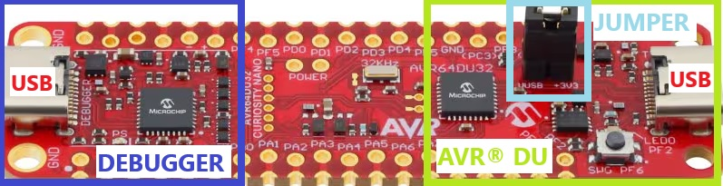
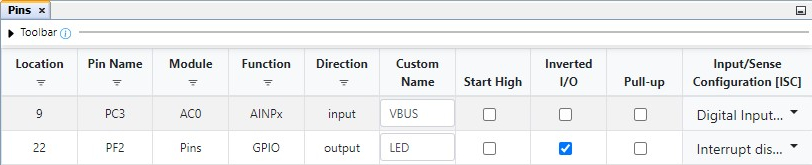
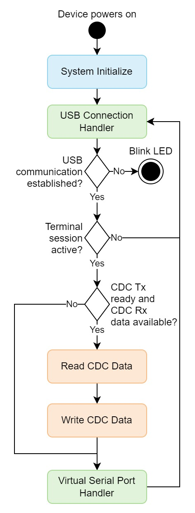
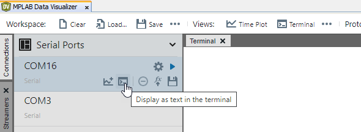

<!-- Please do not change this logo with link -->

[](https://www.microchip.com)

# USB CDC Virtual Serial Port Using AVR® DU Microcontroller
This example shows how to communicate between the AVR DU microcontroller and a host computer using the Universal Serial Bus (USB) Communication Device Class (CDC). In addition to an application that will work with standard terminal applications, a Python® script is included showing how to easily interface with the AVR DU over CDC.

## Related Documentation
- [AVR® DU Family Product Page](https://www.microchip.com/en-us/products/microcontrollers-and-microprocessors/8-bit-mcus/avr-mcus/avr-du?utm_source=GitHub&utm_medium=TextLink&utm_campaign=MCU8_AVR-DU&utm_content=avr64du32-cnano-usb-cdc-virtual-serial-port-mplab-mcc-github&utm_bu=MCU08)
- [USB CDC to USART Bridge Using AVR DU Microcontroller](https://github.com/microchip-pic-avr-examples/avr64du32-cnano-usb-cdc-to-usart-bridge-mplab-mcc.git)
- [USB CDC Specification](https://www.usb.org/document-library/class-definitions-communication-devices-12)

## Software Used
- [MPLAB® X IDE 6.20.0](https://www.microchip.com/en-us/tools-resources/develop/mplab-x-ide?utm_source=GitHub&utm_medium=TextLink&utm_campaign=MCU8_AVR-DU&utm_content=avr64du32-cnano-usb-cdc-virtual-serial-port-mplab-mcc-github&utm_bu=MCU08) or newer
- [MPLAB® XC8 3.0.0](https://www.microchip.com/en-us/tools-resources/develop/mplab-xc-compilers?utm_source=GitHub&utm_medium=TextLink&utm_campaign=MCU8_AVR-DU&utm_content=avr64du32-cnano-usb-cdc-virtual-serial-port-mplab-mcc-github&utm_bu=MCU08) or newer compiler
- [MPLAB® Code Configurator (MCC) 5.5.1](https://www.microchip.com/en-us/tools-resources/configure/mplab-code-configurator?utm_source=GitHub&utm_medium=TextLink&utm_campaign=MCU8_AVR-DU&utm_content=avr64du32-cnano-usb-cdc-virtual-serial-port-mplab-mcc-github&utm_bu=MCU08) plug-in or newer
- [MPLAB Data Visualizer 1.3.1665](https://www.microchip.com/en-us/tools-resources/debug/mplab-data-visualizer) or newer
- [Python 3.11.0](https://www.python.org/) or newer

## Hardware Used
- [AVR64DU32](https://www.microchip.com/en-us/product/AVR64DU32?utm_source=GitHub&utm_medium=TextLink&utm_campaign=MCU8_AVR-DU&utm_content=avr64du32-cnano-usb-cdc-virtual-serial-port-mplab-mcc-github&utm_bu=MCU08)
- [AVR64DU32 Curiosity Nano (EV59F82A)](https://www.microchip.com/en-us/development-tool/EV59F82A?utm_source=GitHub&utm_medium=TextLink&utm_campaign=MCU8_AVR-DU&utm_content=avr64du32-cnano-usb-cdc-virtual-serial-port-mplab-mcc-github&utm_bu=MCU08)

## Setup

### Physical Setup
The AVR DU Curiosity Nano Development board has two USB-C® ports. One debugger port for programming the device via the on-board debugger and one target port directly connected to the AVR DU. While programming the device over the target port is possible using bootloaders, this example uses the Debugger port for programming. After the device is programmed, the Debugger port can be disconnected and the target port must be connected to the host for USB CDC communication.

The Curiosity Nano has an Adjustable Target Regulator that regulates voltage to 3.3V by default. Since the USB peripheral in the AVR64DU32 needs to run at 3.3V, it either needs a 3.3V supply connected on the V<sub>USB</sub> pin or a 5.0V supply on V<sub>DD</sub> with the internal USB Voltage Regulator active. With the Curiosity Nano's default settings, the V<sub>BUS</sub> pinheader on the board must be connected with the included jumper to supply 3.3V directly to V<sub>USB</sub>. This example uses the default settings, requiring the jumper as shown in the image below.

<p></p>

### MCC Project Setup
This section shows how the example is set up in MPLAB using MCC. The image below presents an overview of the complete MCC setup.
<p></p>

1. Start a new Microchip Embedded Application project in MPLAB and select AVR DU as the used device.
2. Open MCC and select *Add Component*>*Library*>*USB Device Stack*.
    * If the USB Device Stack doesn’t show up, the library needs to be added in the Content Manager (CM) menu. The button for the CM menu is in the Device Resources section (by default on the left in MPLAB) or under Tools in the menu.
3. Select Add Component, enable the API filter and add the AC0, RTC and VREF application interfaces (APIs) to the project.
4. Follow the setup below to configure the library and APIs.

#### USB Setup

##### USB General Settings
The configurator is set so that the AVR DU will identify as a CDC device on the highest level. The toggle switch for adding the Virtual Serial example code is also enabled.
<p></p>

##### USB Device Descriptors
For this example, the Device Descriptors section is left as default. For other applications, information on the product can be added here.
<p></p>

##### USB Interfaces
For this example, both a communication and data interface are required.
<p></p>

##### USB CDC Communication Interface
The communication interface determines the communication flow between the host and device. The Abstract Control Model (ACM) is used as a subclass but few of the supported commands are needed. Three Functional Descriptors are also required:
* Header - Required for Functional Descriptors
* ACM - Tells the host what commands the device supports (D1 indicates that device supports basic Line Coding and Control Line State commands needed for terminal applications)
* Union - Tells the host the relationship between two or more interfaces
<p></p>

##### USB CDC Data Interface
All communication is sent over the data interface for this basic Virtual Serial Port application. The Packet Size field determines how much data can be transmitted in one USB packet. The data sent can be bigger or smaller and the stack will transmit a less amount or split it up in smaller packages.
<p></p>

#### Device Clock Setup
This example is configured to run on 24 MHz. The minimum oscillator frequency for USB on the AVR DU is 12 MHz.
<p></p>

The application uses a delay function to blink an LED if the USB connection fails. This delay function is dependent on knowing the main clock speed through the F_CPU define. Here, this has been set up as a pre-processed define macro in the project settings.

<p></p>

Alternatively, it could have been added in the main file as `#define F_CPU 24000000UL` above the `#include <util/delay.h>` line.

#### USB Voltage Detection Setup
To ensure that the USB peripheral only tries to attach to the bus when the Curiosity Nano is connected to the PC, the Analog Comparator (AC) will be checked periodically if the voltage is within the acceptable range for V<sub>BUS</sub>.

#### Voltage Reference Setup
In the V<sub>REF</sub> peripheral, the Voltage Reference is set to 2.048V.
<p></p>

#### Analog Comparator (AC) Setup
The Analog Comparator is typically enabled by default under Hardware Settings.

The positive input is set to the USB DETECT pin on the Curiosity Nano which is connected to positive pin 4 on the AC by default. The detection threshold is set using the internal reference voltage generator (DACREF) which is selected as the negative input to the AC.

To calculate the DACREF, use the formula from the data sheet:

*V<sub>DACREF</sub> = (DACREF / 256) * V<sub>REF</sub>*

Due to the voltage divider present on the Curiosity Nano, a threshold of 0.32V is needed for this project. Input this value into the Requested Voltage field in MCC to calculate the DACREF value automatically.

Refer to the [AVR64DU32 Curiosity Nano User Guide](https://ww1.microchip.com/downloads/aemDocuments/documents/MCU08/ProductDocuments/UserGuides/AVR64DU32-Curiosity-Nano-UserGuide-DS50003671.pdf) for more information on how the USB DETECT is implemented on the Curiosity Nano.

<p></p>

#### RTC Setup
The RTC Periodic Interrupt Timer (PIT) is used to trigger the voltage detection described above.

##### RTC Hardware Settings
The RTC is configured to run on a 1 kHz clock with no prescaler.
<p></p>

##### RTC Interrupt Settings
The PIT is then set to trigger at every 32 clock cycles of the RTC clock, which gives an update rate of ~31 Hz.
<p></p>

The application is set up to need five stable voltage readings before initiating the USB communication.  Considering the previous settings and an environment with no voltage fluctuations, the start-up time is in the 0.16s range.

#### LED Setup
The on-board LED of the Curiosity Nano is used to indicate if the USB communications has failed. The LED is connected to the PF2 pin and can be selected as an output in the **Pin Grid View** tab.

<p></p>

The pin is given a custom name in the Pins menu, as seen below. This makes the code easier to read with the functions generated using this name. Enable Inverted I/O for PF2. The LED will light up when the USB communication works.

<p></p>

#### Global Interrupts
This example uses interrupts for both voltage monitoring and USART communication. Toggle the Global Interrupt Enable button in the Interrupt Manager.

<p></p>

## Programming the AVR®

1. Download the zip file or clone the example to get the source code.
2. Open the ``.X`` project from the source code with the MPLAB® X IDE. Another option is to create a new MPLAB® X project and follow the MCC Setup:
    - In a new project, open MCC and complete the MCC Setup, as explained previously in this document
    - Go to the **Resource Management** tab and click **Generate** under Project Resources, to generate the code
    - Replace the empty ``main.c`` file with the main from the source code
    - The current USB driver has an echo functionality implemented by default, which will result in two echos. To remove this, go to the ``usb/usb_cdc/usb_cdc_virtual_serial_port.c`` file. Find the ``USB_CDCDataReceived()`` function and comment out/remove the ``USB_TransferWriteStart()`` function call (line 150):

    <p>

3. Connect the Debugger USB-C port to the PC and click the **Make and Program Device Main Project** button to program the AVR.

    <p>

    > 🛈 Info: Ensure that the Curiosity Nano has a jumper on by connecting VUSB to +3V3.
4. Connect the target USB-C port, which will be used for the USB CDC communication to the host computer. The Debugger port can be removed or kept plugged in.


## Application Flow
The included MPLAB project is configured to echo back any data received over CDC.

The application continuously checks if there is data in the CDC receive buffer and adds the data to the CDC transmit buffer, as long as the peripheral is ready and the buffer is not full. The diagram bellow illustrates the complete flow of the main application.

<p></p>

The USB part of the application is set up in Polling mode and therefore needs to handle the USB peripheral inside the main loop. Interrupt mode is also selectable in MCC and it simplifies the application by removing the need for USB handler.

## Identify Virtual Serial Port Number
When the device is programmed, it will show up as a Virtual Serial Port on the host. The method to identify the Virtual Serial Port varies between operating systems and the most common cases are listed below. As MPLAB Data Visualizer is used in this example, the appropriate serial ports will show up directly in the program.

### Windows®
In Windows, the easiest way to identify the port number is to go to *Device Manager>Ports (COM and LPT)*. The device shows up as USB Serial Device (COM##), where ## is the number assigned by the host.

Alternatively, the following commands will also list the devices in terminal.

Command Prompt:
```
reg query HKLM\HARDWARE\DEVICEMAP\SERIALCOMM
```

PowerShell:
```
Get-WMIObject Win32_SerialPort | Select-Object Name,DeviceID,Description
```

### macOS®  and Linux®
Using the terminal, add the command below to generate a list of connected devices.

```
ls /dev/tty.*
```

## Operation
This section assumes that the setup has been followed and that the device is programmed and connected to the host.

### MPLAB® Data Visualizer
Step-by-step guide to open communication:
1. Open MPLAB Data Visualizer.
2. Under Serial Ports, find the AVR DU Virtual Serial COM port and select **Display as text in the terminal**.
   * Identify the AVR DU Virtual Serial COM port number which corresponds to the COM port assigned to the target USB-C port using [the guide above](#identify-virtual-serial-port-number)

<p></p>

3. Enter text in the 'Line input' and the AVR DU will echo back the text to the **Terminal** when Enter is pressed.
<p></p>

### Python® Script
Reading data from the USB CDC Virtual Serial Port in a terminal is not always the most practical way to access and display data. This section will demonstrate how to transmit and receive data using a Python script.
1. Program the device and connect the target USB-C port to the host computer.
2. Install the [pyserial](https://pypi.org/project/pyserial/) Python extension.
    ```
    pip install pyserial
    ```
3. Run the provided Python script and check out the results.
    ```
    python usb_cdc_virtual_serial_port.py
    ```

The included script is quite sparse and is only meant to show the basic functionality.

Running the script will print a status message for trying to open the serial communication:

```
Opening serial communication...
```

When communication is established, it will transmit a preset array of values to the AVR DU and print the following:

```
Transmitting Data:
<data transmitted as hex values>
```

The script will then attempt to read the echo from the AVR DU using the number of transmitted bytes as a limit on how many bytes to read. It will then print the received bytes in ASCII form:

```
Received Data:
b'<data received as ASCII characters>'
```

Python's `serial.read()` interprets the returned values as ASCII text, resulting in an array of chars instead of numbers. In the example script, this has been used directly, but if the values are to be used in another format, the read data must be converted.

Finally, the script will close the serial communication so as not to hold up the device for other use.

```
Closing the serial communication.
```

The script itself will try to identify the connected Virtual Serial Port number using the VID and PID used in the MCC setup. If it throws an error, or the VID or PID is changed, the script has an optional argument `-s` that can be used to input the number. This is exemplified below:

```
python usb_cdc_virtual_serial_port.py -s COM10
```

## Summary
By following this example, the user will:
1. Understand the basics of CDC communication on the AVR DU.
2. Be able to create simple applications where CDC is the communication protocol between host and device.
